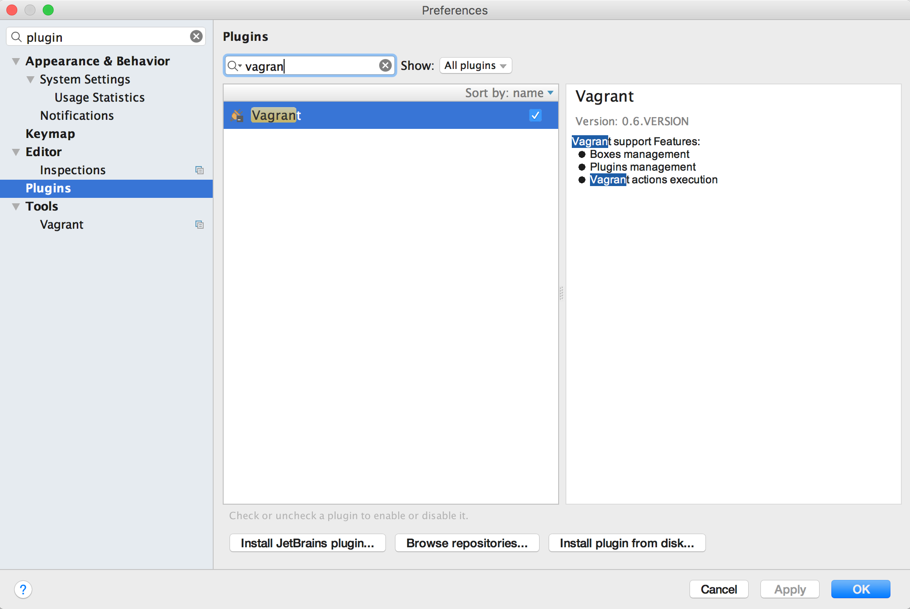

I. Install with Vagrant
===========

1. Install Vagrant

2. Clone our repository

```
	https://github.com/bagiks/property_crawler
	cd property_crawler
```

3. Install Berkshelf

- Download ChefSDK
```
    https://downloads.chef.io/chef-dk/
```

- Install berkshelf plugin

```
    vagrant plugin install vagrant-berkshelf
```

- If there is no `cookbooks/dev` director insite the folder.
    ```
        mkdir -p cookbooks/dev
        cd cookbooks
        berks cookbook dev
     ```
     
    Add cookbook to `cookbooks/Dev/Berksfile`
     ```
        source "https://supermarket.chef.io"

        metadata
        cookbook 'poise-python', '~> 1.4.0'
        cookbook 'vim', '~> 2.0.1'
        cookbook 'mongodb', '~> 0.16.2'
        cookbook 'apt', '~> 4.0.0'

     ```

4. Run vagrant

```
    vagrant up
```

5. ssh to virtual machine

```
    vagrant ssh
```

6. go to project folder at `cd /vagrant_data`.

Scrapy / python / mongodb are installed. Enjoy !

7. Run demo on commandline

```
    scrapy crawl Flats-Property-Crawler
```

8. Run with Pycharm

- Install Vagrant plugin in Pycharm

- "Vagrant up " in `Tools -> Vagrant -> ...`

- Change Python interpreter


- Go to `property_crawler/spiders/9flats.py`, uncomment this block
```python
process = CrawlerProcess({
     'USER_AGENT': 'Mozilla/5.0 (Macintosh; Intel Mac OS X 10_11_5) AppleWebKit/537.36 (KHTML, like Gecko) Chrome/50.0.2661.102 Safari/537.36'
 })

process.crawl(FlatsPropertyCrawlSpider)

process.start()
```
- Run 9flats.py 


II. Install without Vagrant
===========
1. Install Anaconda, python 2.7

2. Creat a new enviroment `scraping` with scrapy package

```bash
	conda create --name scraping Scrapy
```
3. Activate / deactivate the enviroment
``` 
	source actiavate scraping
```
```
	source deactivate
```
4. Clone `property_crawler` repository
```
	https://github.com/bagiks/property_crawler
	cd property_crawler
```
5. Install python package
```
	pip install -r requirements.txt
```
6. Install mongodb and start service
7. Create db `bagiks`, collection `property`
8. Run 
	``` scrapy crawl Flats-Property-Crawler``

---
9. Dev with Pycharm
- Change Python Interpreter to `scraping` enviroment
[https://www.jetbrains.com/help/pycharm/2016.1/configuring-python-interpreter-for-a-project.html]
- Go to `property_crawler/spiders/9flats.py`, uncomment this block
```python
process = CrawlerProcess({
     'USER_AGENT': 'Mozilla/5.0 (Macintosh; Intel Mac OS X 10_11_5) AppleWebKit/537.36 (KHTML, like Gecko) Chrome/50.0.2661.102 Safari/537.36'
 })

process.crawl(FlatsPropertyCrawlSpider)

process.start()
```
- Run 9flats.py 
